# Test Publicly Available CNN Gravity Inversion Software Report

**Taylor Schermer**  
Department of Geology & Geophysics  
University of Utah  
Summer 2026

# 1. Objective

The objective of this project was to reproduce the CNN-based gravity inversion workflow from:
`https://github.com/wanghr323/CNN_gravity_inversion_com-geo ` 

and develop a reusable Python framework for systematically evaluating the pretrained model on independently generated synthetic geological models. Rather than retraining the network, the framework focuses on testing how well the published model generalizes to new geological scenarios.

For each experiment:
- A single compact density body.  
- Multiple density bodies at different depths.  
- A dipping or elongated body.  
- A salt-dome-like structure.  
- A basement-relief model.  
- Models with added noise. 

# 2. Framework Overview

A modular Python framework was developed to automate the complete evaluation workflow. Each experiment follows the same sequence of steps:

1. Generate a synthetic density model.
2. Compute the corresponding gravity anomaly using forward modeling.
3. Apply the published pretrained CNN to recover a density model.
4. Compare the recovered density model with the true model using quantitative metrics.
5. Forward model the recovered density to verify that it reproduces the input gravity anomaly.
6. Automatically generate figures and export all evaluation metrics.

# 3. Experimental Results

## 3.1 Published Example Reproduction

The published CNN-based gravity inversion workflow was reproduced using the example provided by the original authors.

### Input Gravity Anomaly

Figure 3.1 shows the gravity anomaly supplied to the CNN. This anomaly represents the synthetic observation that the network uses as input to reconstruct the underlying density distribution.

  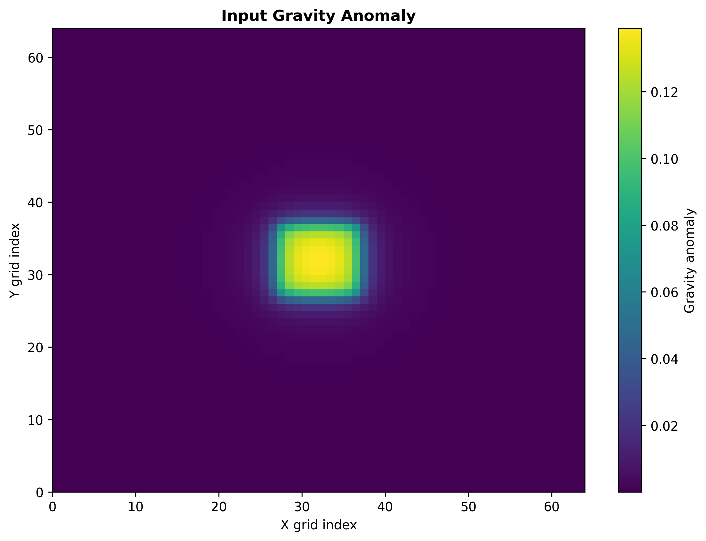

### Density Model Reconstruction

Figures 3.2 and 3.3 compare the true and recovered density models. The CNN correctly recovers the body's location, depth, and overall geometry, although the recovered boundaries are smoother than the binary true model.

| True Density Model | Predicted Density Model |
|:-------------------:|:-----------:|
| 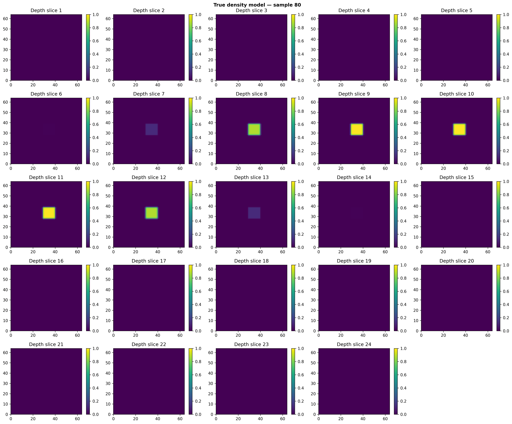 | 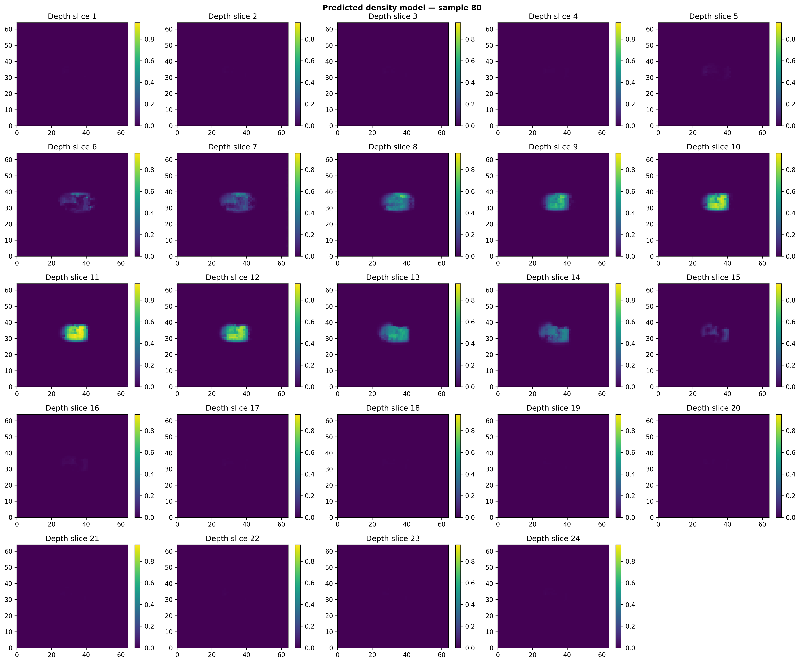 |

### Forward-Model Validation

The recovered density model was then forward modeled and compared with the original gravity anomaly. Figure 3.4 shows close agreement between the reconstructed and reference gravity anomalies, with a residual on the order of 10⁻⁵, confirming that the published workflow was successfully reproduced.

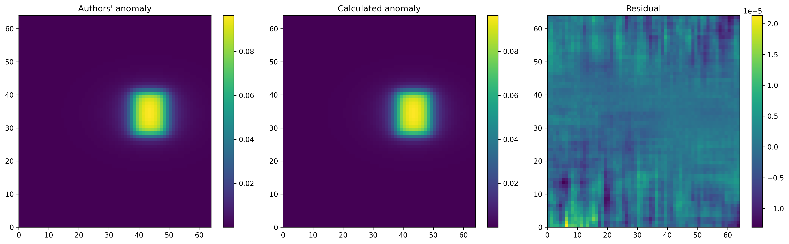

## Interpreting the Comparison Figures

Unless otherwise noted, each experiment uses the same comparison layout. The **left column** shows the true density model, the **middle column** shows the density model recovered by the pretrained CNN, and the **right column** shows the residual (true minus recovered).

The **top row** shows a horizontal slice (x-y plane), while the **middle** and **bottom rows** show vertical cross-sections (x-z and y-z planes). The colorbars indicate density values for the true and recovered models and residual values for the difference plots.

## 3.2 Single Compact Density Body

The first set of synthetic experiments evaluated the pretrained CNN on simple isolated density bodies similar to those used during the network's original training. 
Two representative examples are shown: a manually designed body shifted away from the center of the model and a randomly generated compact body.

### Interpreting the Comparison Figures

Unless otherwise noted, each experiment uses the same comparison layout. The **left column** shows the true density model, the **middle column** shows the density model recovered by the pretrained CNN, and the **right column** shows the residual (true minus recovered).

The **top row** shows a horizontal slice (x-y plane), while the **middle** and **bottom rows** show vertical cross-sections (x-z and y-z planes). The colorbars indicate density values for the true and recovered models and residual values for the difference plots.

| Medium Shifted Left | Random Body |
|:-------------------:|:-----------:|
| 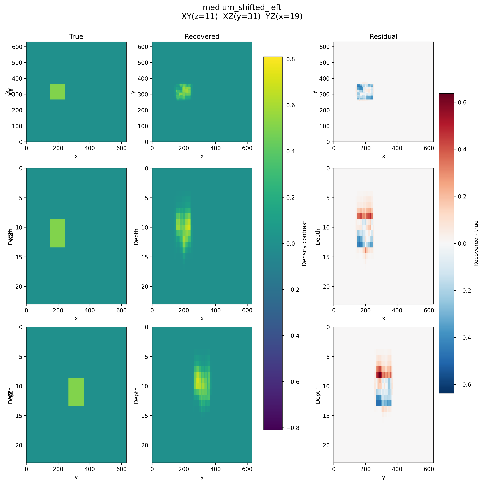 | 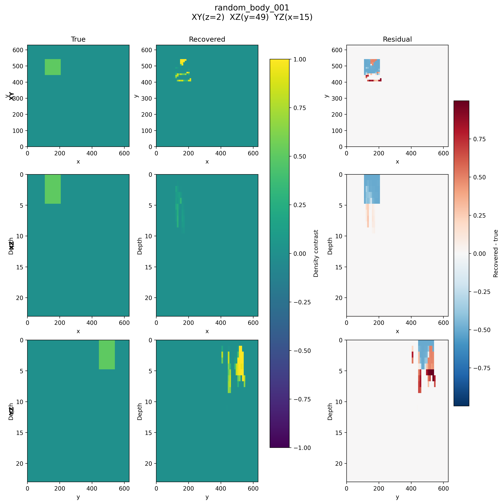 |

The following metrics are used throughout the remainder of this report to evaluate reconstruction quality.

- **Density Correlation:** Measures how well the recovered density matches the spatial distribution of the true model. Higher values indicate better agreement.
- **Density Relative L₂:** Measures the normalized reconstruction error. Lower values indicate better reconstructions.
- **Density IoU:** Measures the overlap between the recovered and true density models after thresholding. Higher values indicate greater overlap.
- **Density Dice:** Measures the overall similarity between the recovered and true density models. Higher values indicate better agreement.
- **Gravity Correlation:** Measures how well the gravity anomaly produced by the recovered model matches the input gravity anomaly. 

**Key metrics**

| Case Name | Density Correlation | Density Relative L₂ | Density IoU | Density Dice | Gravity Correlation |
| --- | ---: | ---: | ---: | ---: | ---: |
| medium_shifted_left | 0.689 | 0.767 | 0.460 | 0.630 | 0.995 |
| random_body_001 | 0.254 | 1.493 | 0.142 | 0.248 | 0.824 |

The pretrained CNN performs best when the target geology resembles the data it was trained on. The **medium_shifted_left** case is recovered accurately, while the more complex **random_body_001** case shows lower density agreement and higher reconstruction error. Even so, the recovered model still reproduces much of the observed gravity anomaly.

*Full metrics: `../synthetic_models/01_single_compact_body/metrics/single_compact_body_metrics.csv`*

## 3.3 Multiple Bodies at Different Depths

This experiment introduced multiple density bodies at different depths. Compared to the single-body cases, the overlapping gravity signals make it more difficult for the CNN to recover the location and geometry of each body.

  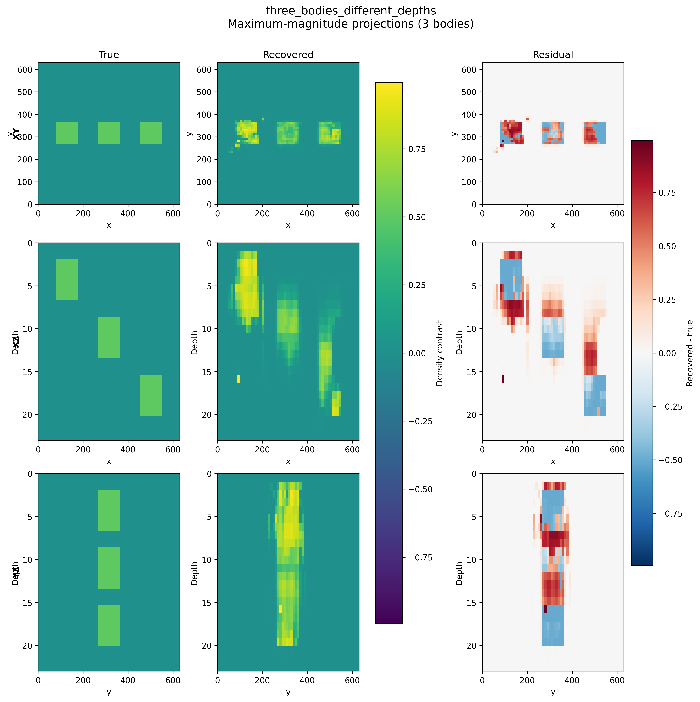

The recovered model correctly identifies all three density bodies and preserves their overall spatial distribution. Although the recovered bodies have smoother boundaries and differ somewhat in size from the true models, each anomaly is reconstructed as a distinct feature rather than merging into neighboring bodies. This indicates that the pretrained CNN remains capable of separating multiple sources even as the inversion problem becomes more ambiguous.

**Key metrics**

| Case Name | Density Correlation | Density Relative L₂ | Density IoU | Density Dice | Gravity Correlation |
| --- | ---: | ---: | ---: | ---: | ---: |
| three_bodies_different_depths | 0.534 | 0.980 | 0.337 | 0.504 | 0.918 |

Compared with the single-body experiment, reconstruction quality decreases as multiple bodies contribute to the observed gravity field. The overlapping gravity anomalies increase the non-uniqueness of the inversion problem, making it more difficult to recover the exact geometry of each body.

Connected-component analysis showed that all **three** true bodies were successfully identified in the recovered model. Although the recovered bodies have smoother boundaries and some positional error, the CNN consistently detects the correct number and approximate location of the anomalies. This suggests the pretrained CNN is better at localizing multiple bodies than recovering their exact shapes.

*Full metrics: `../synthetic_models/02_multiple_depths/metrics/multi_body_depth_metrics.csv`*

## 3.4 Dipping Body

The previous experiments focused on compact density bodies. This experiment evaluated the pretrained CNN on elongated dipping structures, providing a more realistic test of its ability to generalize to complex geological features.

| 30° Dipping Slab | 45° Elongated Prism |
|:----------------:|:--------------:|
| 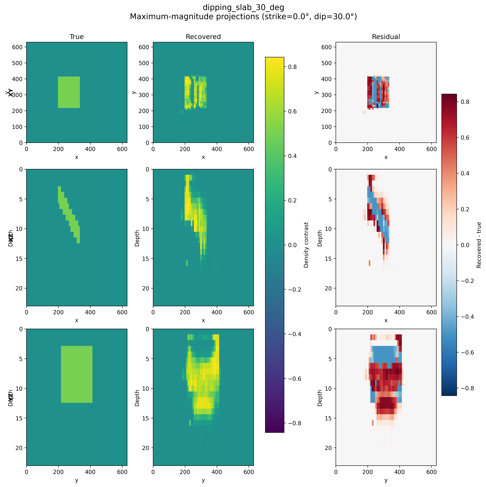 | 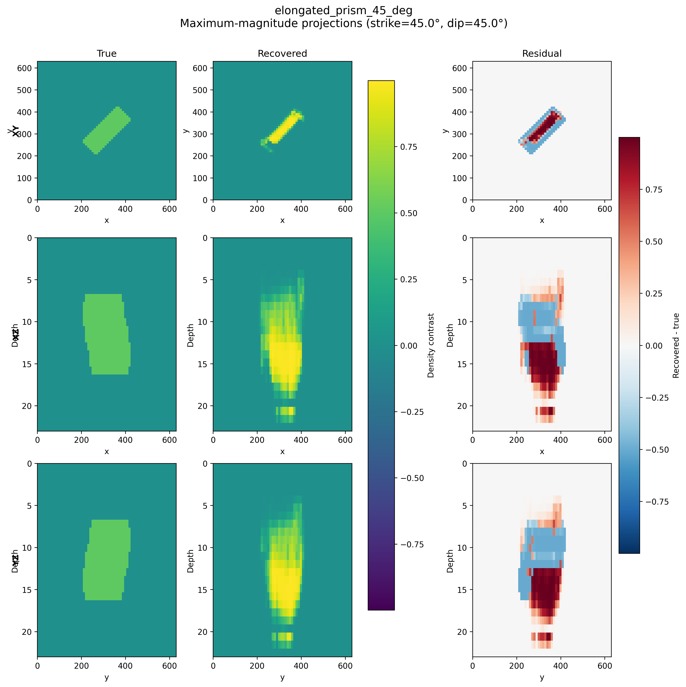 |

Despite the increased geometric complexity, the pretrained CNN successfully recovered the two dipping bodies. The recovered models preserve the general orientation, depth, and location of each structure, although the boundaries are smoother and slightly more diffuse than the true models. This behavior is consistent with the previous experiments and reflects the continuous output of the CNN rather than a failure to identify the underlying geological feature.

**Key metrics**

| Case Name | Density Correlation | Density Relative L₂ | Density IoU | Density Dice | Gravity Correlation | Center Error (cells) |
| --- | ---: | ---: | ---: | ---: | ---: | ---: |
| dipping_slab_30_deg | 0.533 | 1.010 | 0.354 | 0.523 | 0.921 | 0.69 ||
| elongated_prism_45_deg | 0.545 | 1.129 | 0.389 | 0.560 | 0.937 | 1.76 |

The pretrained CNN performs consistently on both dipping structures. Density correlations remain around **0.54**, Dice coefficients range from **0.52–0.56**, and gravity correlations exceed **0.92**. The recovered bodies are also well localized, with center errors of only **0.69** and **1.76** grid cells.

These results suggest that the pretrained CNN can generalize beyond the compact bodies used during training. Although the recovered models have smoother boundaries than the true models, the network accurately recovers the orientation and location of elongated dipping structures.

*Full metrics: `../synthetic_models/03_dipping_body/metrics/dipping_body_metrics.csv`*

## 3.5 Salt-Dome-Like Structures

The previous experiments focused on compact and elongated density bodies. This experiment introduced salt-dome-like structures with curved boundaries and both positive and negative density contrasts. Four negative-density domes and one positive-density control case were evaluated.

| Cylindrical (Negative) | Positive Control |
|:----------------------:|:----------------:|
| 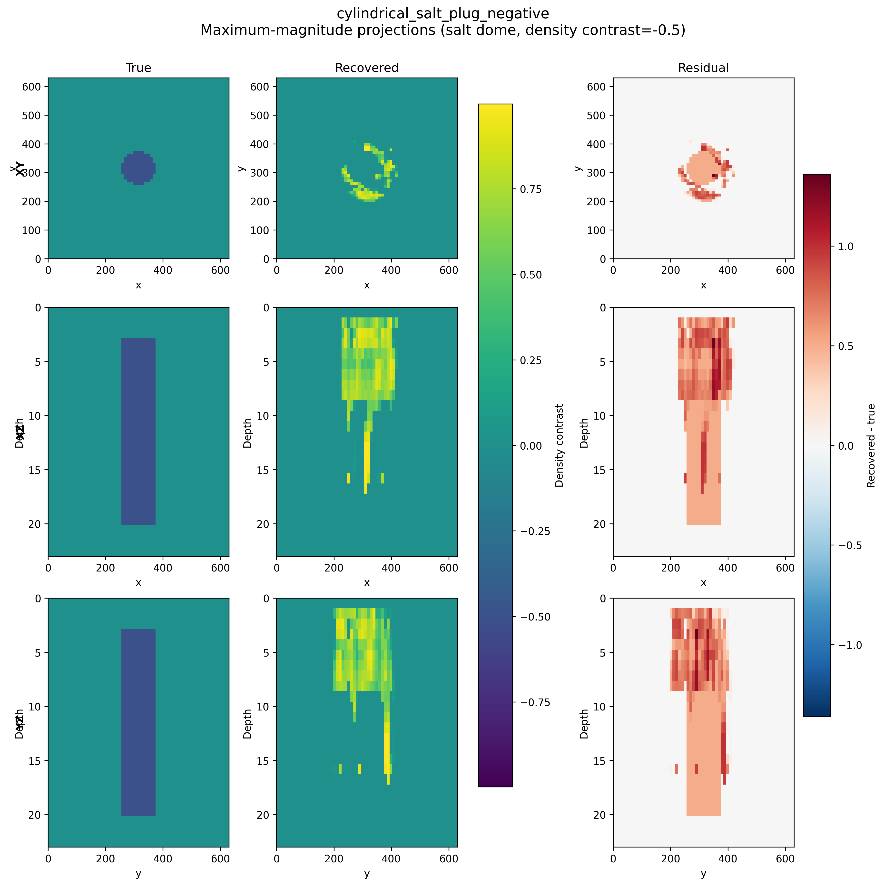 | 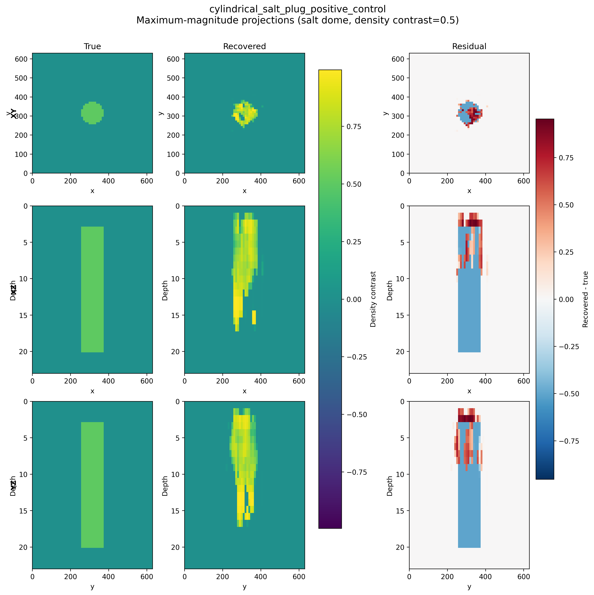 |

| Tapered Dome | Bulbous Dome |
|:------------:|:------------:|
|  | 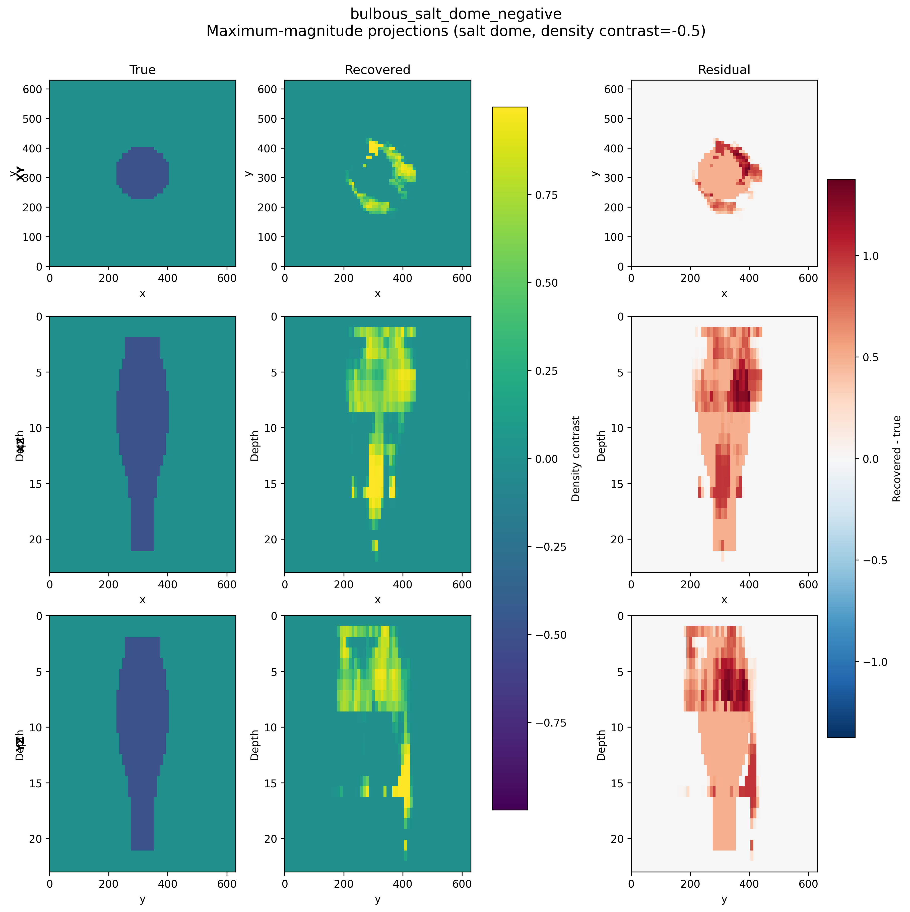 |

| Mushroom Dome |
|:-------------:|
| 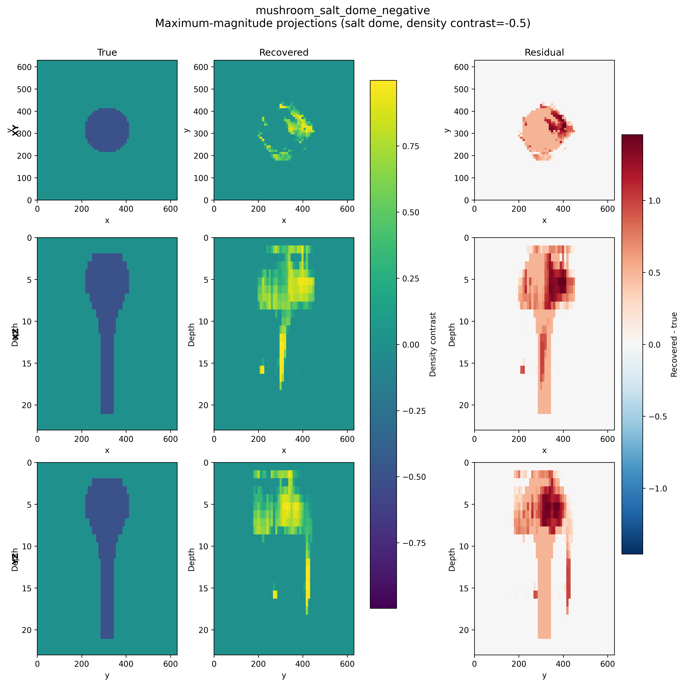 |

The positive-density control is reconstructed with moderate accuracy, while the negative-density domes show little agreement with the true models. This difference is clear in both the reconstructed images and the quantitative metrics.

**Key metrics**

| Case Name | Density Correlation | Density Relative L₂ | Density IoU | Density Dice | Gravity Correlation |
| --- | ---: | ---: | ---: | ---: | ---: |
| cylindrical_salt_plug_negative | -0.011 | 1.201 | 0.010 | 0.020 | 0.717 |
| cylindrical_salt_plug_positive_control | 0.545 | 0.883 | 0.340 | 0.507 | 0.981 |
| tapered_salt_dome_negative | -0.043 | 1.229 | 0.027 | 0.053 | 0.664 |
| bulbous_salt_dome_negative | -0.051 | 1.203 | 0.029 | 0.056 | 0.651 |
| mushroom_salt_dome_negative | -0.190 | 1.266 | 0.081 | 0.150 | 0.598 |

The positive-density control was reconstructed much more accurately than the negative-density cases, suggesting that density contrast has a greater impact on reconstruction quality than geometry. While the CNN can recover rounded positive-density structures, it struggles to generalize to negative-density bodies.

Although some negative-density cases still produce moderate gravity correlations, their density correlations and overlap metrics remain poor.

Overall, these results suggest that the pretrained CNN is limited by the range of density contrasts represented in its training data.

*Full metrics: `../synthetic_models/04_salt_dome/metrics/salt_dome_metrics.csv`*

## 3.6 Basement Relief

The previous experiments focused on discrete density bodies. This experiment evaluated the pretrained CNN on broad, continuous basement interfaces, requiring it to recover a subsurface boundary instead of individual anomalies.

Five basement geometries were tested: a flat control, a tilted basement, circular and elongated uplifts, and a sinusoidal basement surface.

| Flat Control | Tilted Basement |
|:------------:|:---------------:|
| 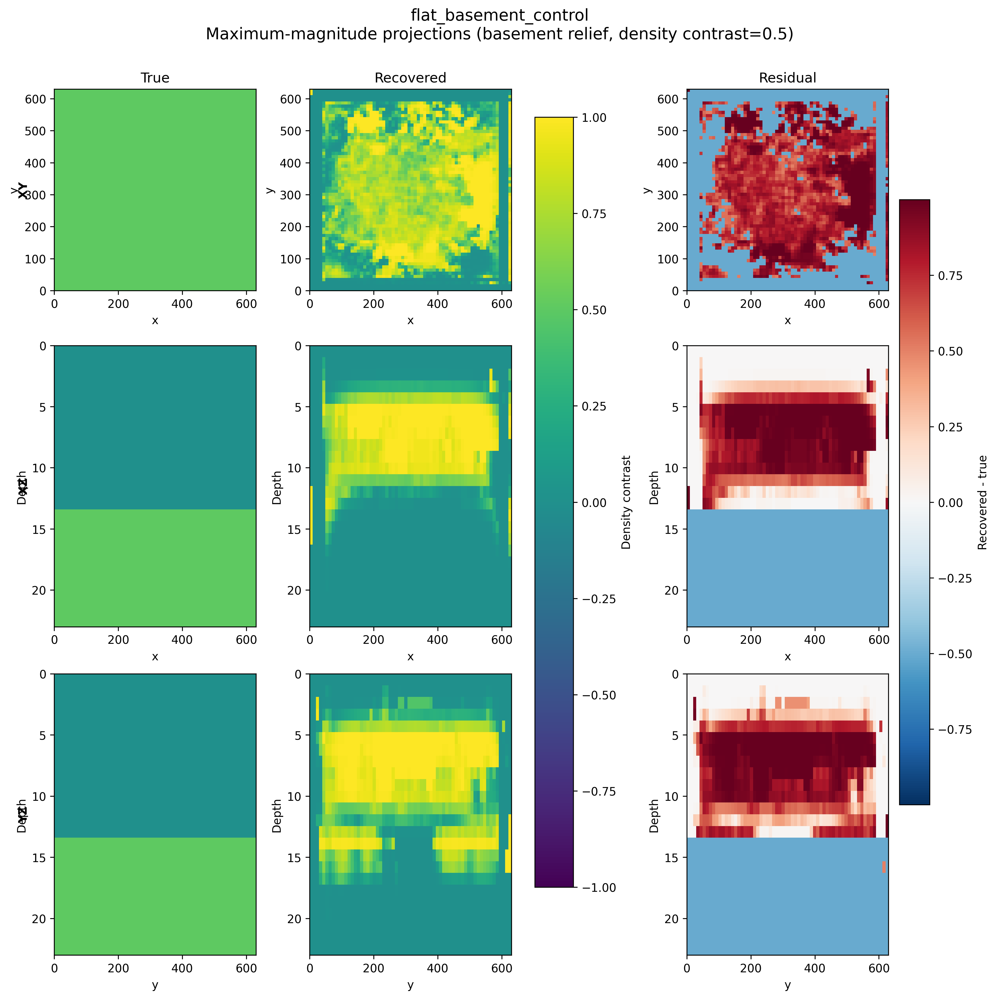 | 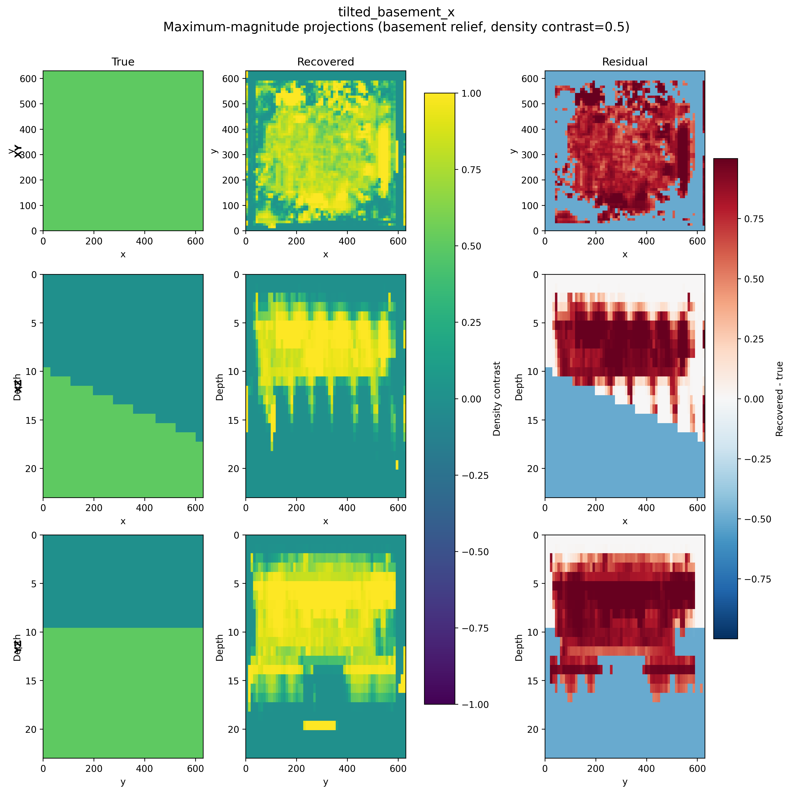 |

| Circular Uplift | Elongated Uplift |
|:---------------:|:----------------:|
| 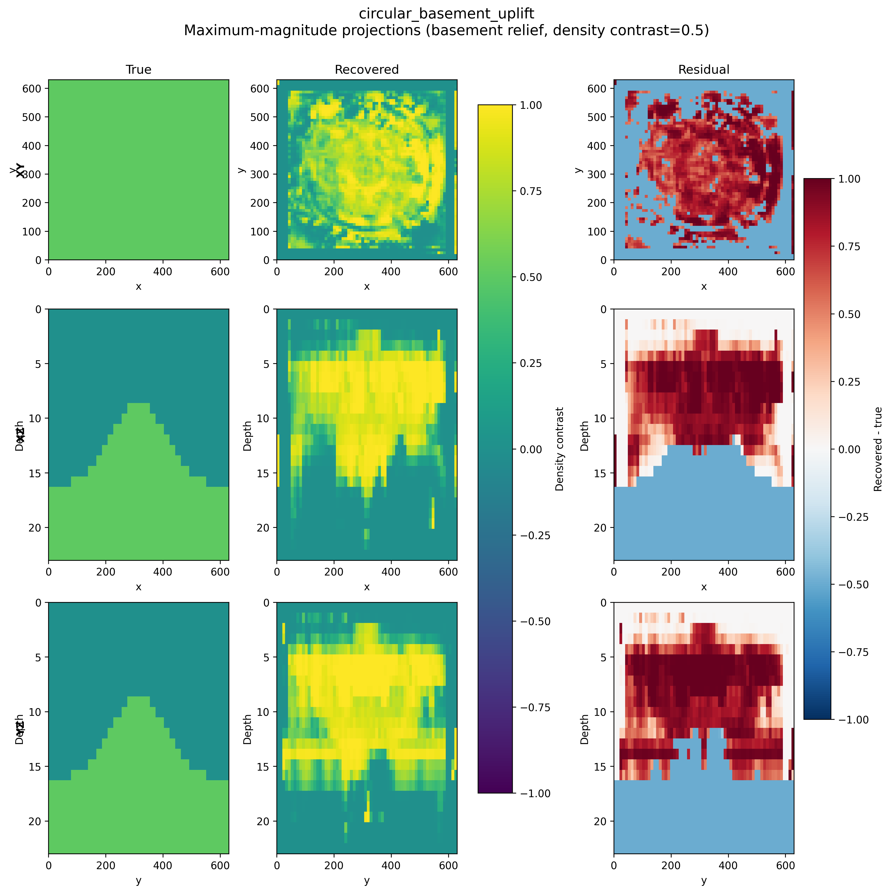 | 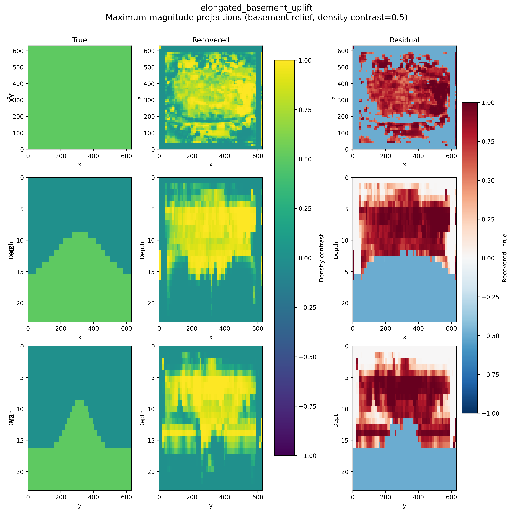 |

| Sinusoidal Basement |
|:-------------------:|
| 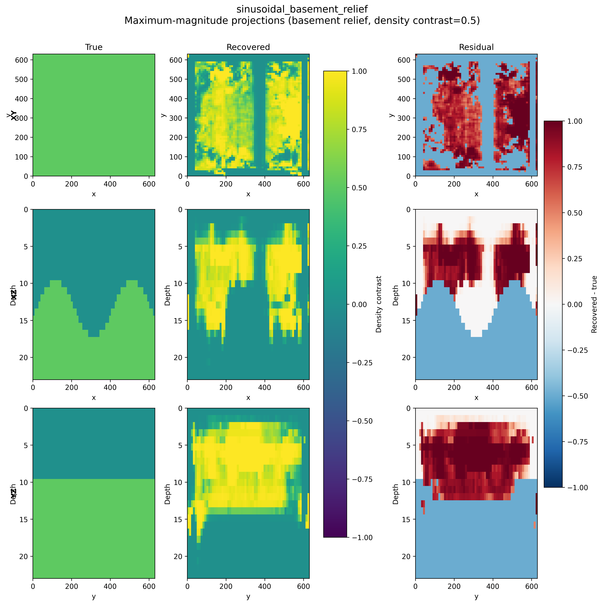 |

Across all five basement models, the pretrained CNN struggles to recover the continuous interface. Rather than reconstructing the overall basement geometry, the recovered models fragment the interface into localized anomalies that only loosely resemble the true structures.

**Key metrics**

| Case Name | Density Correlation | Density Relative L₂ | Density IoU | Density Dice | Gravity Correlation |
| --- | ---: | ---: | ---: | ---: | ---: |
| flat_basement_control | -0.362 | 1.260 | 0.003 | 0.005 | 0.689 |
| tilted_basement_x | -0.348 | 1.256 | 0.009 | 0.018 | 0.388 |
| circular_basement_uplift | -0.225 | 1.253 | 0.023 | 0.045 | 0.886 |
| elongated_basement_uplift | -0.226 | 1.249 | 0.022 | 0.043 | 0.861 |
| sinusoidal_basement_relief | -0.208 | 1.176 | 0.044 | 0.084 | 0.468 |

The quantitative metrics support these observations. All five cases produced negative density correlations, Relative L₂ errors greater than **1**, and very low IoU and Dice values, indicating little agreement between the recovered and true basement interfaces. However, the circular and elongated uplift cases still achieved gravity correlations above **0.86**, showing that a model can reproduce the gravity field without recovering the correct geology.

These results highlight a limitation of the pretrained CNN. While it performs well on localized density bodies, it struggles with broad, continuous basement interfaces that were likely underrepresented in the training data.

*Full metrics: `../synthetic_models/05_basement_relief/metrics/basement_relief_metrics.csv`*

## 3.7 Noise Robustness

The final experiment evaluated how the pretrained CNN performs as measurement noise increases. A compact density body was used as the reference model, and additive Gaussian noise was applied at levels of 0%, 1%, 2%, 5%, and 10% of the maximum gravity anomaly.

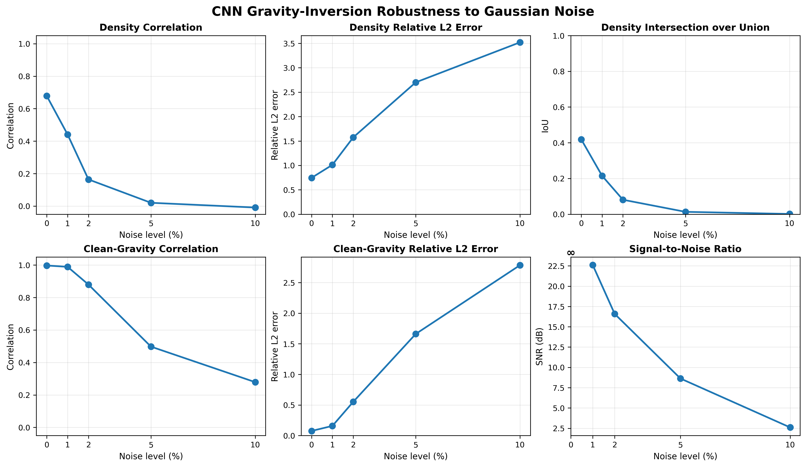

**Key metrics**

| Case Name | Noise Percent | Density Correlation | Density Relative L₂ | Density IoU | Density Dice | Clean CNN Gravity Correlation |
| --- | ---: | ---: | ---: | ---: | ---: | ---: |
| noise_test_compact_body_noise_00_percent | 0 | 0.678 | 0.746 | 0.419 | 0.591 | 0.997 |
| noise_test_compact_body_noise_01_percent | 1 | 0.441 | 1.012 | 0.215 | 0.354 | 0.989 |
| noise_test_compact_body_noise_02_percent | 2 | 0.164 | 1.574 | 0.081 | 0.150 | 0.880 |
| noise_test_compact_body_noise_05_percent | 5 | 0.020 | 2.702 | 0.013 | 0.026 | 0.498 |
| noise_test_compact_body_noise_10_percent | 10 | -0.009 | 3.520 | 0.001 | 0.003 | 0.279 |

Reconstruction quality decreases as the noise level increases. Even low levels of noise reduce density agreement, and at **5–10%** noise the network is no longer able to recover the original body accurately.

Gravity correlation also decreases, dropping from **0.997** with no noise to **0.279** at **10%** noise. Unlike previous experiments, where an incorrect density model could still reproduce the gravity field, measurement noise degrades both the recovered density model and the reconstructed gravity response. These results suggest the pretrained CNN is robust to low noise levels but degrades quickly as noise increases.

*Full metrics: `../synthetic_models/06_noise_tests/metrics/noise_cnn_robustness_metrics.csv`*

# 4. Overall Findings

The published CNN-based gravity inversion workflow was successfully reproduced, and a modular Python framework was developed to evaluate the pretrained CNN on a variety of synthetic geological models.

The pretrained CNN performs well on compact bodies, multiple-body models, and dipping structures, but reconstruction quality decreases as the geology becomes more complex. Negative-density salt domes, continuous basement interfaces, and noisy data all expose limitations in the network's ability to generalize beyond the examples represented in its training data.

The noise experiments showed that the pretrained CNN is reasonably robust to low noise levels but degrades rapidly as measurement noise increases.

# 5. Next Steps

The next phase of this project will focus on modifying the CNN gravity inversion workflow by incorporating regularization and physical constraints. The current pretrained network is primarily data driven, which can lead to unstable or geologically unrealistic solutions for more challenging inversion problems.